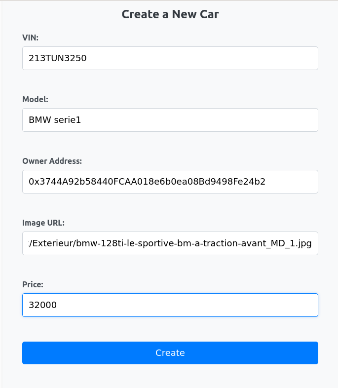
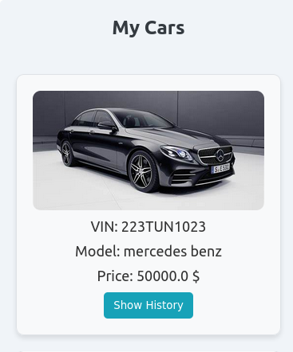
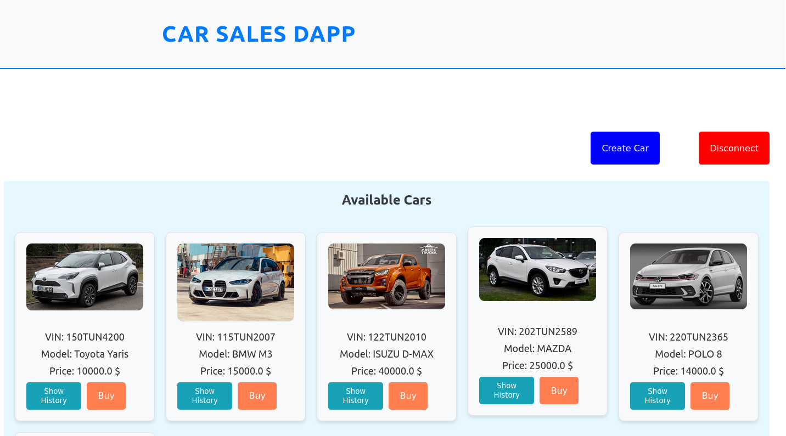
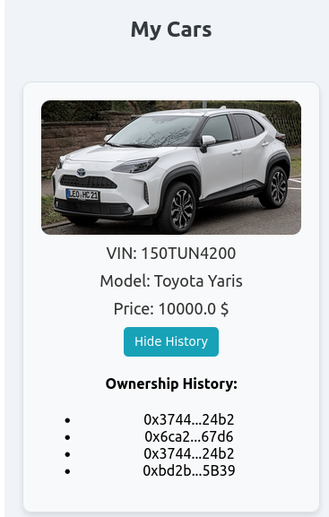

#  🚙Projet de vente et traçabilité des voitures sur Blockchain

## 🌐 Introduction

La blockchain et les NFT (Non-Fungible Tokens) transforment la manière dont les biens numériques sont représentés et échangés. Ce projet se concentre sur le développement d'une DApp (Decentralized Application) pour gérer et afficher des voitures sous forme de NFT en utilisant React, Web3, et les smart contracts sur Ethereum.

### 🎯 Objectif du Projet

Notre objectif principal est de créer une plateforme innovante qui facilitera la vente et la création des voitures avec la certification de constructeur et la possibilité de retracer les différents propriétaires d'un même véhicule.

- **Création des voitures** : Créer les voitures sous forme de NFT et les associer à un utilisateur.
- **Affichage de détails des voitures** : Récupération des détails de chaque Voiture.
- **Réduire le besoin d'intermédiaires** : Limiter le nombre d'acteurs impliqués dans la transaction pour diminuer les coûts.
- **Offrir des options de paiement en cryptomonnaies** : Élargir les possibilités de paiement pour les utilisateurs.
- **Assurer une traçabilité complète des proprietères** : Permettre un suivi transparent de l'historique des proprietères.


## 💻 Installation

### Installation de Ganache

Pour installer Ganache, vous avez deux options :

1. **Interface graphique** :
   - Téléchargez l'interface graphique depuis le site officiel de Truffle.

2. **Version CLI** :
   - Installez la version CLI via npm :
     ```bash
     npm install -g ganache
     ```

3. **Téléchargement direct** :
   - Vous pouvez également télécharger Ganache à partir de [ce site](https://archive.trufflesuite.com/ganache/).

### Configuration de MetaMask

1. Installez l'extension MetaMask dans votre navigateur. Vous pouvez l'ajouter à Google Chrome via le Chrome Web Store.
2. Créez un nouveau portefeuille ou importez-en un existant.
3. Configurez les comptes MetaMask avec les clés privées des comptes Ganache.

### Installation de Node.js, Truffle

1. **Installer Node.js** :
   - Téléchargez et installez Node.js à partir du [site officiel](https://nodejs.org/).

2. **Installer truffle** :
   - Dans votre terminal, exécutez :
     ```bash
     npm install -g truffle
     ```

## 🚀 Démarrage du Projet

Pour lancer le projet, suivez ces étapes :

1. **Ouvrir Ganache** :
   - Lancez Ganache pour créer un environnement de développement local pour vos transactions Blockchain.
  
2. **Installer les dépendances** :
    - Naviguez dans le répertoire du projet et exécuter cette commande :
       ```bash
       npm install 
       ```

2. **Backend** :
   - Configurer le deployment script dans votre project pour utiliser votre réseau ganache local:
     ```bash
     truffle migrate -reset
     ```

3. **Frontend** :
   - Naviguez dans le répertoire du frontend et démarrez l'application React :
     ```bash
     npm start
     ```


## 🛠️ Utilisation

Pour utiliser l'application, suivez ces étapes :

1. Ouvrez votre navigateur et accédez à `http://localhost:3000`.
2. Créez un compte ou connectez-vous si vous en avez déjà un.
3. Naviguez dans la plateforme et commencer à créer vos voitures.
4. Effectuez des transactions en utilisant les options de paiement disponibles.

## 🛠️ Technologies Utilisées

- **Smart contract Solidity** : Explication rapide de la définition et de l'implémentation du contrat CarFactory.
- **Node.js** : Pour le développement du backend.
- **React** : Pour l'interface utilisateur.
- **ether et web3** : Pour la connexion et l'interaction avec Ethereum.
  
## 📋 Présentation du Projet

Ce projet innovant utilise la technologie Blockchain pour simplifier et sécuriser le processus de vente des voitures. Voici un aperçu des principales fonctionnalités de l'application.

### 1. Créer une voiture (Create Car)

Cette fonctionnalité permet aux utilisateurs de créer des voitures à la plateforme. L'interface est conçue pour être intuitive et facile à utiliser.



### 2. Mes voitures (My Cars)

Dans cette section, les utilisateurs peuvent consulter leurs propriétés enregistrées qui seront automatiquement disponibles pour vente pour autres utilisateurs.




### 3. Voitures disponibles (Available cars)

Les utilisateurs peuvent explorer toutes les voitures disponibles sur la plateforme. Chaque propriété peut être achetée en cliquant sur le bouton "Buy".



### Historique des propriétaires

Les utilisateurs peuvent accéder à leur historique de transactions en cliquant sur le bouton "Show History". Cela ouvre une interface dédiée où ils peuvent consulter tous les propriétaires précedants du voiture.



## 🏁 Conclusion

Cette application de vente immobilière sur Blockchain vise à révolutionner le marché des voitures en rendant les transactions plus simples, plus rapides et plus sécurisées. Nous espérons que notre plateforme apportera une véritable valeur ajoutée aux utilisateurs, tout en leur offrant une expérience utilisateur exceptionnelle. 🌟
